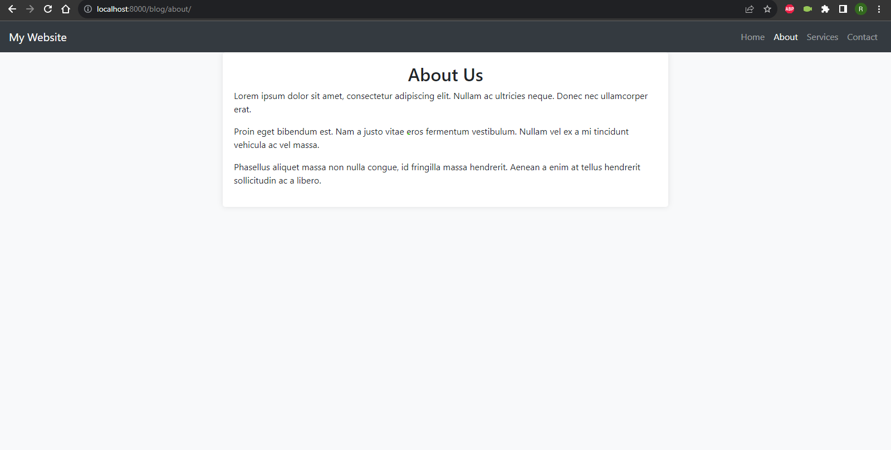

### Django Application


### Step 1: Create a virtual env in python
Set up your virtual env and pip install ```
django
``` 
```bash
python -m venv venv

./venv/Scripts/activate
```

### Step 2: Create *django* project
Use the `django-admin` command to create a new Django project. Replace `myproject` with your desired project name.
```bash
django-admin startproject myproject
```

### Step 3: Create *django* app
You can create Django apps within your project to organize your code. Use the following command to create an app:
```bash
python manage.py startapp myapp
```
This will create a sub-directory with the same name

### Step 4: 
#### Your Directory structure looks like this -

myproject/
├── myproject/
│   ├── urls.py
│   ├── settings.py
│   └── views.py
└── blog/
	├── apps.py
    ├── urls.py
    └── views.py


    - in our app directory(blog) there is a file named ```apps.py```, which has a class 
      inheritaing from AppConfig class. Copy the name of the class and go to 
      ```settings.py``` in root dir.


    - paste it in the ```INSTALLED_APPS``` list under your:
```py
	[APP_NAME].apps.[CLASS_NAME]
```
        
        
    - create a ```templates``` dir in your app and then another dir of your ```APP_NAME``` inside and then all the html files. Like so -

myproject/
├── myproject/
│   ├── urls.py
│   ├── settings.py
│   └── views.py
└── blog/
    ├── templates/
    │   └── blog/
    │       └── index.html
    ├── apps.py
    ├── urls.py
    └── views.py


    - got to ```views.py``` and make necessary changes by looking into views.py


### Create *home.html*, *register.html* and *about.html*



